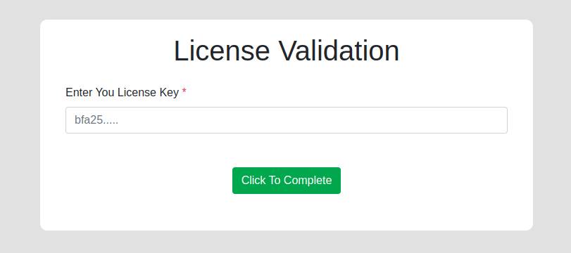
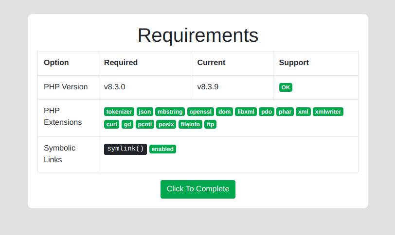
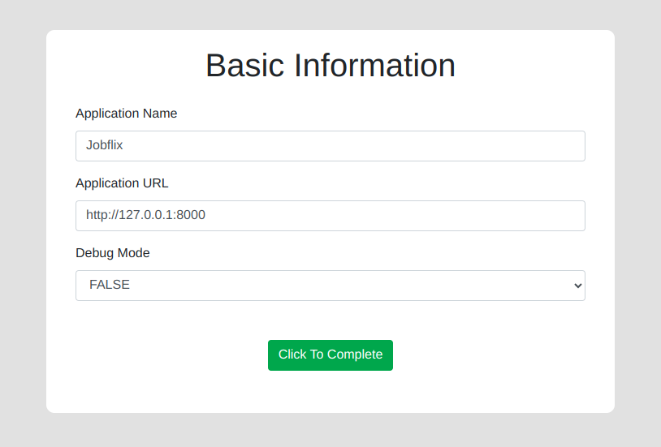
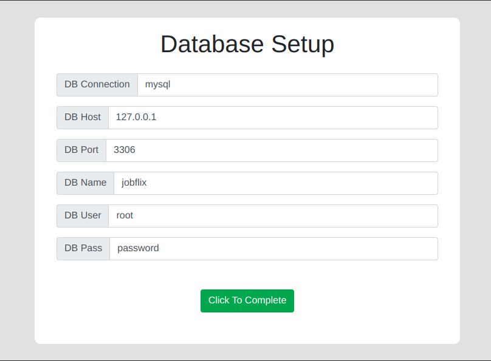

# Laravel One Click Installer - A Minimalist Laravel Installer Package

The installer package you need for your laravel application in release field. The simplest, minimalistic installer for your application. Works on any laravel version!

## Installation

You can install the package via composer:

``` bash
    composer require devzkhalil/laravel-one-click-installer
```

### Publish Configuration

Publish configuration file

```bash
    php artisan vendor:publish --tag=installer
```

### Publish Assets

Publish assets file

```bash
    php artisan vendor:publish --tag=installer-assets
```

### Setup and configure

The installer configuration is the only major work for this package. So follow carefully this step.  
The configuration file ``config/installer.php`` comes with some installation properties. The properties are also well documented in the comment of the file. Also, a brief description is given here:

```php
    'php' => [
        
            /**
             * MINIMUM PHP VERSION
             * --------------------------------------
             * Define the minimum php version 
             * required for you application
             * 
             */

            'min' => '7.3.0',

            /**
             * REQUIRED PHP EXTENSIONS
             * --------------------------------------
             * Define here which extensions are
             * required for your application.
             * 
             */

            'exts' => ['tokenizer','json'],
        ],

         /**
         * HERE IS THE ALL STEPS FOR INSTALLER
         * --------------------------------------
         * If you don't any one just comment out this step
         * Please don't change single word, 
         * if it then system will be break
         */

        'steps' => [
            // 'license_validation',
            'check_required_extensions',
            'basic_information_setup',
            'database_setup',
            'smtp_setup',
        ],


        /**
         * LICENSE INFORMATION
         * --------------------------------------
         * Give your license validation api 
         */

        'license' => [
            'api' => null,
        ],

        /**
         * CHECK FOR SYMLINK
         * --------------------------------------
         * If your migration contains the artisan
         * command of storage:link , or any 
         * symbolic link operation, then you 
         * might need to check if your hosting/system
         * service supports creating symlinks
         * 
         */

        'symlink' => true,

        /**
         * PERFORM MIGRATION?
         * --------------------------------------
         * Does you application runs migration 
         * to setup your database?
         * 
         */

        'migration' => false,

        /**
         * SQL FILE NAME
         * --------------------------------------
         * If your application does not like
         * migration to setup db, and you want
         * to use .sql file to upload to DB
         * to setup, define its name here.
         * 
         * It should be placed inside "database/sql/app.sql"
         * directory.
         * 
         * example: 'sql' => 'app.sql'
         * 
         */

        'sql' => null,

        /**
         * SMTP ENV DATA
         * --------------------------------------
         * If you want to setup some more 
         * env attribute during setup time,
         * place them bellow here.
         * 
         */

        'smtp' => [
            [
                'key' => 'MAIL_MAILER',
                'title' => 'SMTP Route'
            ],
            [
                'key' => 'MAIL_HOST',
                'title' => 'SMTP Mail Host'
            ],
            [
                'key' => 'MAIL_PORT',
                'title' => 'SMTP Mail Port'
            ],
            [
                'key' => 'MAIL_USERNAME',
                'title' => 'SMTP Mail Username'
            ],
            [
                'key' => 'MAIL_PASSWORD',
                'title' => 'SMTP Mail Password'
            ],
            [
                'key' => 'MAIL_ENCRYPTION',
                'title' => 'SMTP Encryption'
            ],
            [
                'key' => 'MAIL_FROM_ADDRESS',
                'title' => 'SMTP From Address'
            ],
            [
                'key' => 'MAIL_FROM_NAME',
                'title' => 'SMTP From Name'
            ],
        ],

        /**
         * COMPLETE INSTALLATION REDIRECT
         * --------------------------------------
         * Redirect after completing the 
         * installation.
         * Provide url here.
         * 
         * example: /home
         */

        'redirect' => '/',

        /**
         * INSTALLER CONFIGURATION 
         * --------------------------------------
         * Do not change these configs.
         */

        'installed' => env('INSTALLER_INSTALLED', false),
```


After done configuring
```bash
    php artisan config:cache
```

## Usage

- Install this package
- Keep a skeleton .env file with an initial ``APP_KEY`` Generated
- Browse ``your-site.com/install`` to get started.

### Additional Notes
- You do not need to delete any file or uninstall the package after installation, it's middleware protected
- If you want to change the APP_KEY after installation, keep a migration with ``Artisan::call('key:generate')``
- Installer setup is always developer-end work, so be sure your migration runs without any bug normally. A developer can manually check the migration from fresh terminal install, even the installer give the migration output, the user can not debug your migration errors. So before applying installer, be sure about your migrations.

## Examples 





## Advanced Usage

Export the views to customize your design of installer! (If you wish to customize)

```bash
    php artisan vendor:publish --tag=installer-views
```

## Changelog

Please see [CHANGELOG](CHANGELOG.md) for more information what has changed recently.
