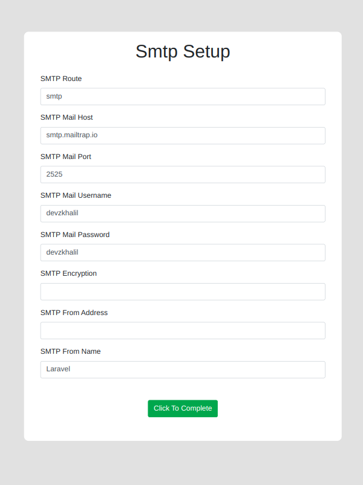

# Laravel One Click Installer - A Minimalist Laravel Installer Package

The installer package you need for your laravel application in release field. The simplest, minimalistic installer for your application. Works on any laravel version!

## Installation

You can install the package via composer:

``` bash
composer require devzkhalil/laravel-one-click-installer
```

### Publish Configuration

Publish configuration file

```bash
php artisan vendor:publish --tag=installer-config
```

### Publish Assets

Publish assets file

```bash
php artisan vendor:publish --tag=installer-assets
```

### Setup and configure

The installer configuration is the only major work for this package. So follow carefully this step.  
The configuration file ``config/installer.php`` comes with some installation properties. The properties are also well documented in the comment of the file. Also, a brief description is given here:

```php
    /**
     * INSTALLER CONFIGURATION
     * --------------------------------------
     * Configure your application installer
     * before deploying the installer.
     */
    
    'php' => [
        /**
         * MINIMUM PHP VERSION
         * --------------------------------------
         * Define the minimum PHP version required
         * for your application.
         */
        'min' => '8.3.0',

        /**
         * REQUIRED PHP EXTENSIONS
         * --------------------------------------
         * Define the PHP extensions required
         * for your application.
         */
        'extensions' => [
            'tokenizer',
            'json',
            'mbstring',
            'openssl',
            'dom',
            'libxml',
            'pdo',
            'phar',
            'xml',
            'xmlwriter',
            'curl',
            'gd',
            'pcntl',
            'posix',
            'fileinfo',
            'ftp',
        ],
    ],

    /**
     * INSTALLATION STEPS
     * --------------------------------------
     * Define all steps for the installer.
     * Comment out any step you don't need.
     * Do not change any word; altering the
     * steps can break the system.
     */
    'steps' => [
        // 'license_validation',
        'check_required_extensions',
        'basic_information_setup',
        'database_setup',
        'smtp_setup',
    ],

    /**
     * LICENSE INFORMATION
     * --------------------------------------
     * Provide your license validation API.
     */
    'license' => [
        'license_input_name' => 'license',
        'api' => null,
    ],

    /**
     * SYMLINK SUPPORT
     * --------------------------------------
     * If your migrations include the artisan
     * command `storage:link` or any symbolic
     * link operations, check if your hosting/system
     * supports creating symlinks.
     */
    'symlink' => true,

    /**
     * PERFORM MIGRATION?
     * --------------------------------------
     * Does your application run migrations
     * to set up your database?
     */
    'migration' => false,

    /**
     * SQL FILE NAME
     * --------------------------------------
     * If your application does not use
     * migrations to set up the database,
     * and you prefer using an SQL file,
     * define its name here.
     * 
     * Place the SQL file inside "database/sql/app.sql".
     * 
     * example: 'sql' => 'app.sql'
     */
    'sql' => null,

    /**
     * SMTP ENVIRONMENT VARIABLES
     * --------------------------------------
     * If you need to set up additional
     * environment variables during setup,
     * define them here.
     */
    'smtp' => [
        [
            'key' => 'MAIL_MAILER',
            'title' => 'SMTP Route'
        ],
        [
            'key' => 'MAIL_HOST',
            'title' => 'SMTP Mail Host'
        ],
        [
            'key' => 'MAIL_PORT',
            'title' => 'SMTP Mail Port'
        ],
        [
            'key' => 'MAIL_USERNAME',
            'title' => 'SMTP Mail Username'
        ],
        [
            'key' => 'MAIL_PASSWORD',
            'title' => 'SMTP Mail Password'
        ],
        [
            'key' => 'MAIL_ENCRYPTION',
            'title' => 'SMTP Encryption'
        ],
        [
            'key' => 'MAIL_FROM_ADDRESS',
            'title' => 'SMTP From Address'
        ],
        [
            'key' => 'MAIL_FROM_NAME',
            'title' => 'SMTP From Name'
        ],
    ],

    /**
     * COMPLETION REDIRECT
     * --------------------------------------
     * Define the URL to redirect to after
     * completing the installation.
     * 
     * example: '/home'
     */
    'redirect' => '/',
```


After done configuring
```bash
php artisan config:cache
```

## Usage

- Install this package
- Keep a skeleton .env file with an initial ``APP_KEY`` Generated
- Browse ``your-site.com/install`` to get started.

### Additional Notes
- You do not need to delete any file or uninstall the package after installation, it's middleware protected
- If you want to change the APP_KEY after installation, keep a migration with ``Artisan::call('key:generate')``
- Installer setup is always developer-end work, so be sure your migration runs without any bug normally. A developer can manually check the migration from fresh terminal install, even the installer give the migration output, the user can not debug your migration errors. So before applying installer, be sure about your migrations.

## Examples 




## Advanced Usage

Export the views to customize your design of installer! (If you wish to customize)

```bash
php artisan vendor:publish --tag=installer-views
```

## Changelog

Please see [CHANGELOG](CHANGELOG.md) for more information what has changed recently.
